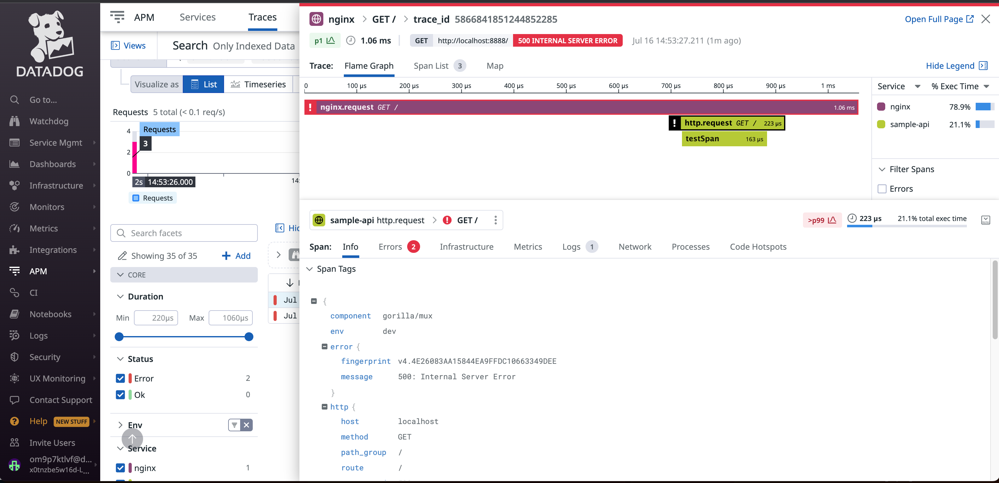

A sample docker compose project for testing distributed tracing of [nginx-datadog](https://github.com/DataDog/nginx-datadog/).



## Prerequisites

```
export DD_API_KEY=<your_api_key>
```

## Run
Make sure your runtime environment is linux/amd64 so that Datadog nginx module to work properly.

```sh
docker-compose up -d
```

In order to create a Datadog APM Trace and Logs entry, run

```sh
# make a request to the nginx container running on docker-compose
curl localhost:8888
```
